# Guia das telas

Este documento mostra **cada tela do sistema**, com uma imagem e a explicação do
que acontece ali. Foi escrito para quem está vendo a loja pela primeira vez e não
precisa entender nada de programação.

> As imagens foram tiradas do sistema rodando com **dados de exemplo**. O nome
> "MeuServidor", o IP `jogar.meuservidor.com.br` e os produtos que aparecem são
> só demonstração — tudo isso é trocado por você no painel, sem mexer em código.

O sistema tem **dois lados**:

| Lado | Quem usa | Endereço |
|---|---|---|
| **A loja** | Os jogadores que vão comprar | `seusite.com.br` |
| **O painel** | Você, dono do servidor | `seusite.com.br/admin` |

---

# Parte 1 — O que o jogador vê

## 1. Página inicial

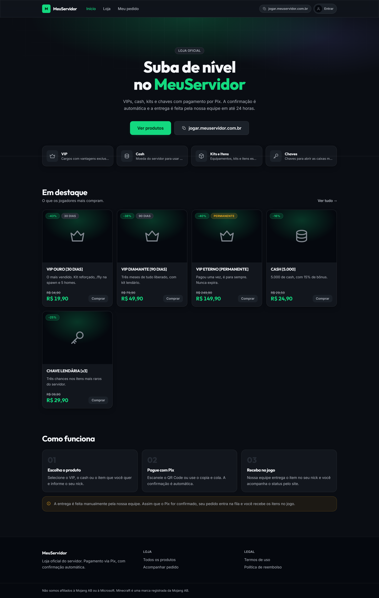

A porta de entrada. De cima para baixo:

- **Topo fixo** — logo, menu (Início, Loja, Meu pedido), o **IP do servidor com
  botão de copiar** e o botão de entrar com o nick. O IP fica sempre à mão de
  propósito: quem chega na loja muitas vezes ainda nem entrou no servidor.
- **Chamada principal** — o nome do servidor em destaque e uma frase explicando
  que o pagamento é por Pix, com confirmação automática e entrega pela equipe.
- **Atalhos das categorias** — VIP, Cash, Kits e Itens, Chaves.
- **Em destaque** — os produtos que você marcou como destaque no painel. Cada
  card mostra o preço antigo riscado, o preço atual, o desconto em porcentagem e
  a etiqueta de duração (30 DIAS, 90 DIAS, PERMANENTE).
- **Como funciona** — os três passos da compra, em linguagem de jogador.
- **Aviso de entrega manual** — a faixa amarela. Ela existe para evitar o
  problema mais comum desse tipo de loja: o jogador pagar e achar que vai receber
  na hora. O texto dessa faixa é editável no painel.

## 2. Janela do nick

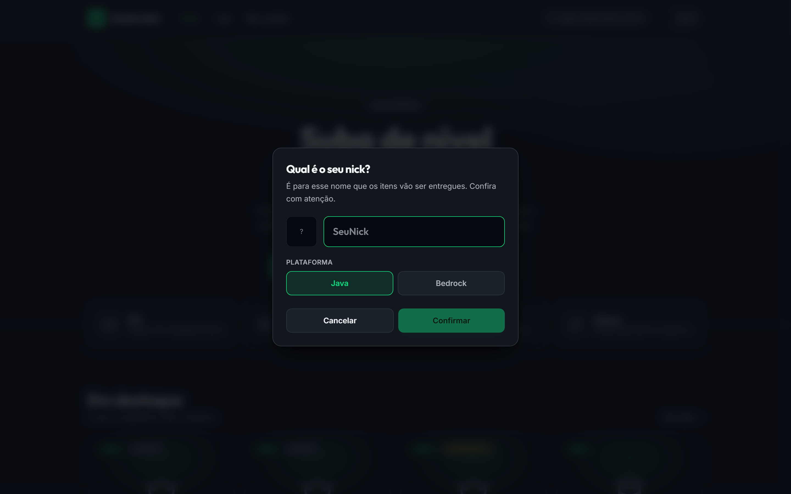

Ao clicar em **Entrar**, a loja pede só o nick — não existe cadastro, nem senha,
nem e-mail nessa etapa. É de propósito: quanto menos passos, mais gente termina a
compra.

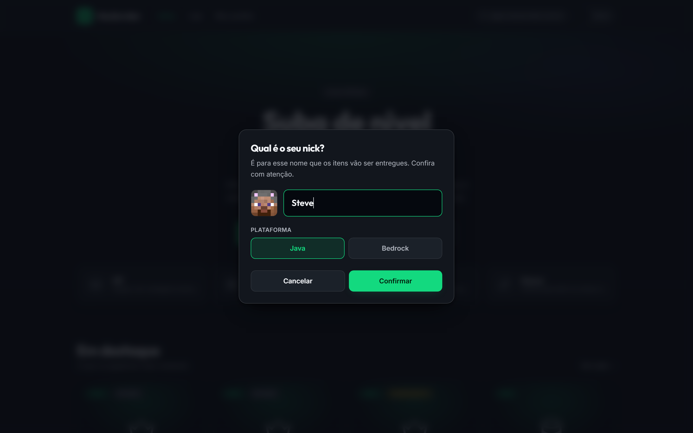

Assim que o nick é digitado, **o skin do jogador aparece**. Isso não é enfeite: o
nick é o endereço de entrega do pedido. Ver a carinha certa é a forma mais rápida
de a pessoa perceber que digitou errado — antes de pagar.

O nick fica guardado no navegador dela e já vem preenchido nas próximas compras.

## 3. Loja (catálogo)

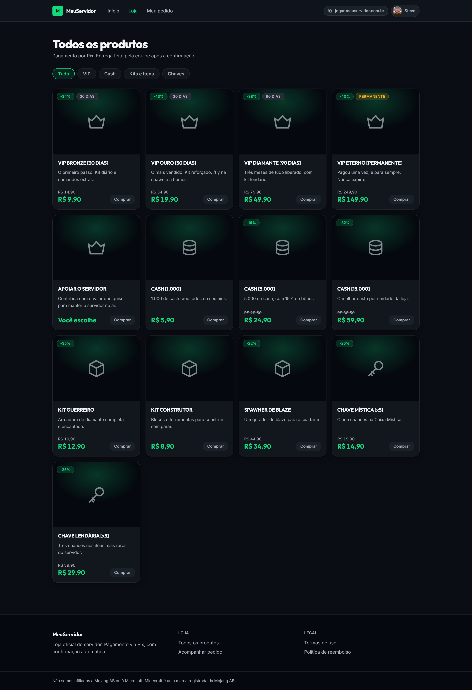

Todos os produtos ativos, em grade. Os botões no topo filtram por categoria.

Produtos **inativos não aparecem aqui** — é assim que você tira algo de venda sem
apagar nada.

## 4. Página do produto

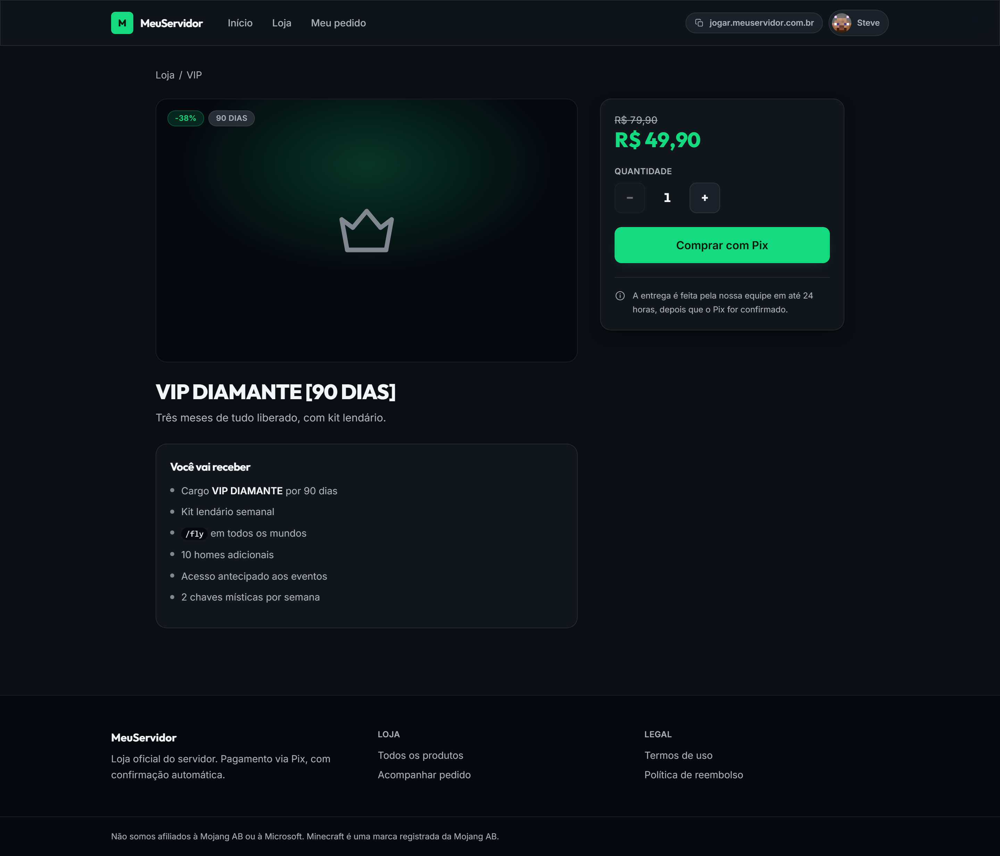

A página de venda de um item. Tem a imagem grande, o preço, a lista **"Você vai
receber"** (escrita por você no painel), o seletor de quantidade e o botão
**Comprar com Pix**.

Quando o produto tem estoque limitado, a quantidade disponível aparece; quando
acaba, o botão vira **Esgotado**.

## 5. Finalizar compra

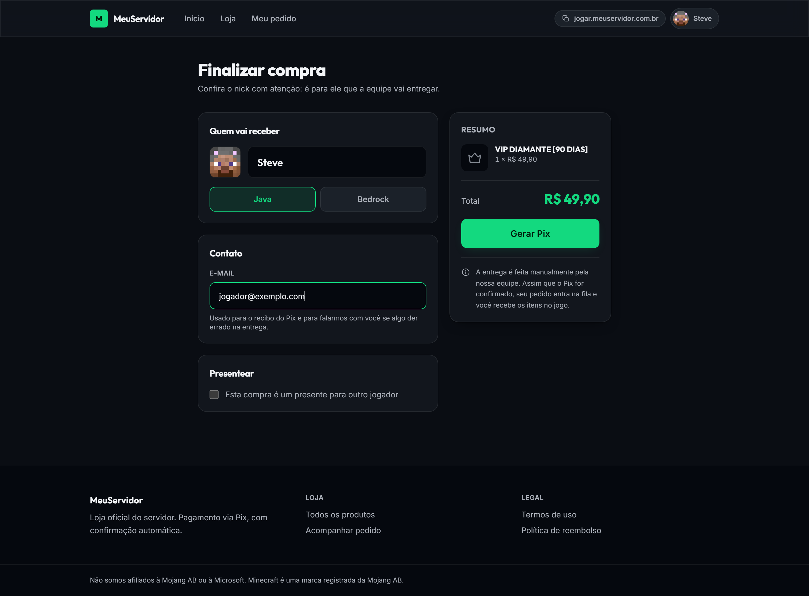

A última conferência antes de gerar o Pix:

- **Quem vai receber** — o nick, com o skin ao lado, e a escolha entre **Java** e
  **Bedrock**.
- **Contato** — o e-mail. Serve para o recibo do Pix e para você conseguir falar
  com a pessoa se der algum problema na entrega.
- **Presentear** — marcando essa caixa, aparece um segundo campo, para o nick de
  quem vai receber. Uma pessoa paga, outra recebe.
- **Resumo, à direita** — o item, o total e o botão **Gerar Pix**.

> **Detalhe importante de segurança:** o preço que aparece aqui é só informativo.
> Quando o botão é clicado, o servidor **recalcula o total** a partir do preço
> cadastrado no banco de dados. Mesmo que alguém altere a página no próprio
> navegador para dizer que o VIP custa R$ 0,01, a cobrança sai no valor certo.

## 6. Pagamento por Pix

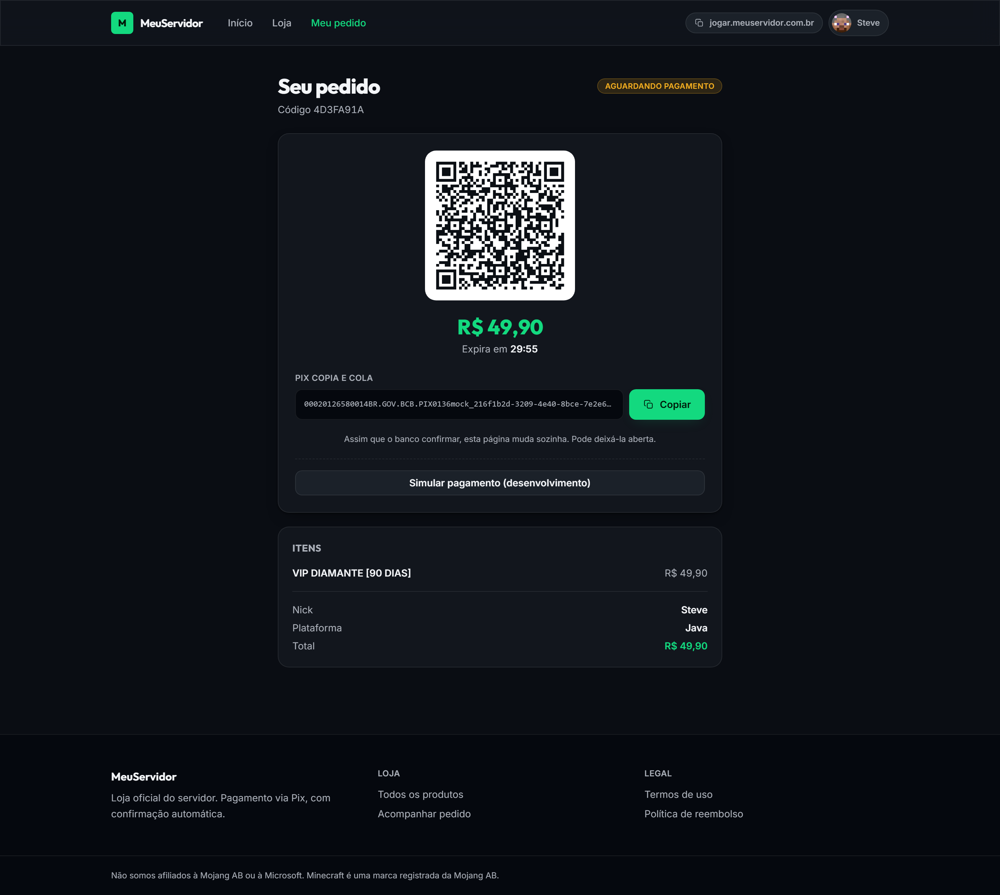

Aqui o jogador paga:

- **QR Code**, para quem está no computador e vai ler pelo celular.
- **Pix copia e cola** com botão de copiar, para quem já está no celular — que é
  a maioria. O app do banco está no mesmo aparelho.
- **Contador de expiração** — o código vale 30 minutos.
- A frase *"Assim que o banco confirmar, esta página muda sozinha"*. A página
  consulta o status a cada poucos segundos; ninguém precisa atualizar nada.

> O botão cinza **"Simular pagamento"** só existe no ambiente de teste. Na loja
> publicada ele não aparece.

## 7. Pagamento confirmado

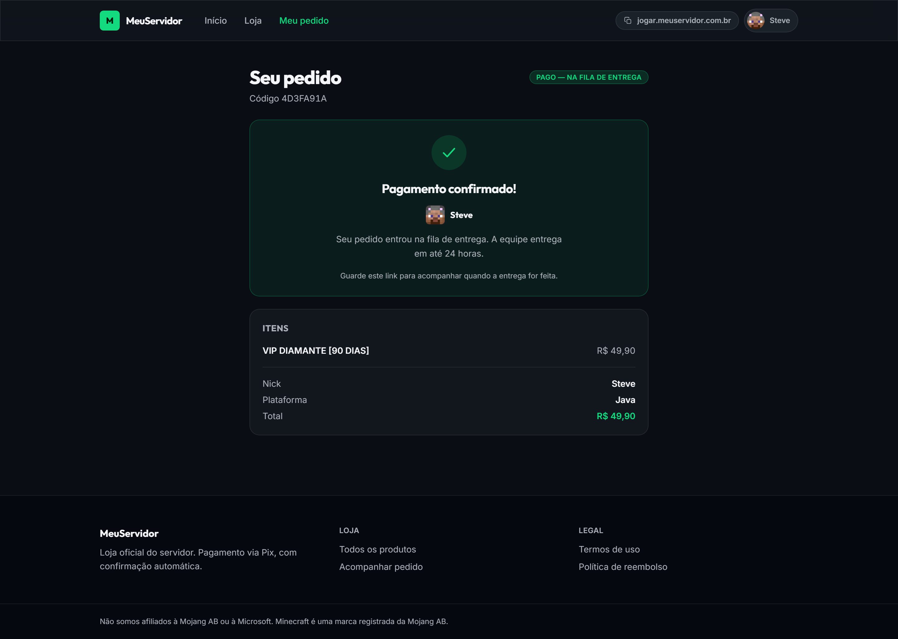

Assim que o Pix cai, a mesma página vira esta, **sozinha**. Ela diz o que
acontece agora (o pedido entrou na fila) e em quanto tempo (o prazo que você
configurou), e pede para a pessoa guardar o link.

Esse link é o comprovante dela: guardado, mostra depois que o pedido foi
entregue.

## 8. Acompanhar pedido

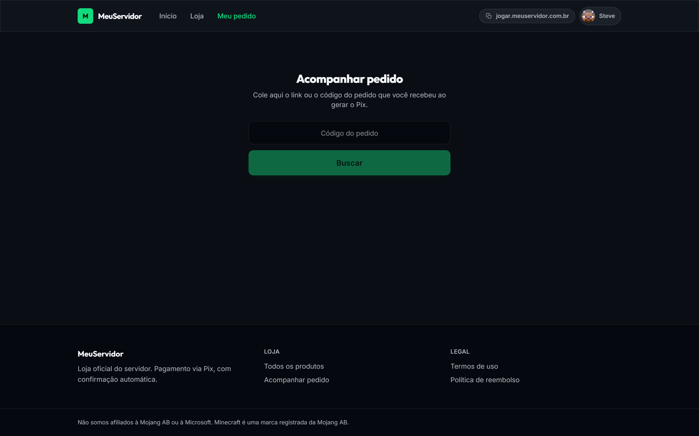

Para quem fechou a aba e quer voltar. Basta colar o **código do pedido** (aquele
que aparece embaixo de "Seu pedido") e a página mostra o status atual.

## 9. Termos de uso e Política de reembolso

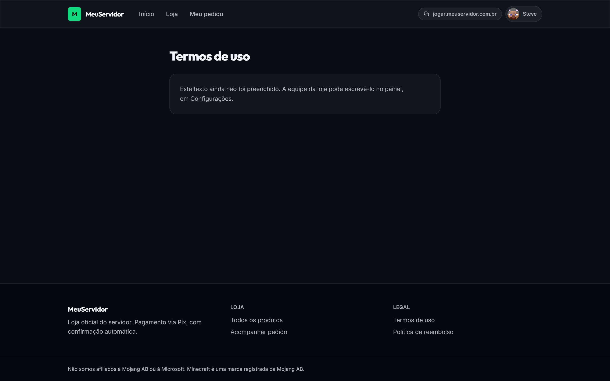

Duas páginas de texto, ligadas no rodapé. Na imagem elas estão **vazias**, que é
como o sistema chega até você.

> **Preencha as duas antes de vender.** No Brasil, o Código de Defesa do
> Consumidor dá direito de arrependimento em 7 dias na compra online, e espera-se
> que uma loja tenha essas páginas. O texto se escreve no painel, em
> Configurações.

---

# Parte 2 — O painel (só você entra)

## 10. Entrada do painel

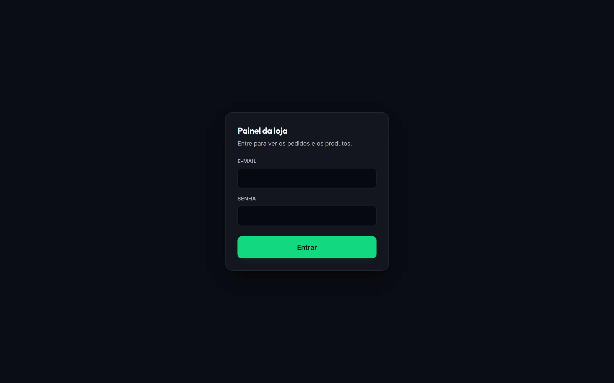

Endereço: **`seusite.com.br/admin`**. Pede e-mail e senha.

Três coisas acontecem nos bastidores:

- Depois de 5 tentativas erradas seguidas, aquele computador fica **15 minutos
  bloqueado** — mas isso nunca tranca *você*, vindo da sua casa (veja o
  [documento de segurança](03-seguranca.md)).
- A senha nunca é guardada como texto. Fica guardada de forma embaralhada e
  impossível de reverter.
- Essa página **não aparece no Google**, de propósito.

## 11. Pedidos — a tela do seu dia a dia

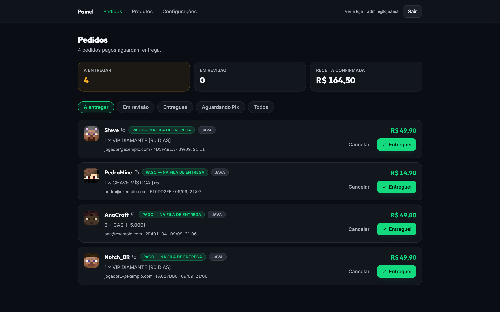

É aqui que você trabalha. A primeira aba, **A entregar**, é a fila do que já foi
pago e ainda não foi entregue.

No topo, três números: quantos pedidos estão **a entregar**, quantos estão **em
revisão** e a **receita confirmada**.

Cada linha traz tudo o que você precisa para entregar sem sair da tela:

- **O skin e o nick**, com um botãozinho ao lado que **copia o nick** — para
  colar direto no comando do jogo, sem risco de errar uma letra.
- O que foi comprado e a quantidade.
- A plataforma (Java ou Bedrock).
- O e-mail, o código do pedido e a data.
- O botão verde **Entreguei** e a opção **Cancelar**.

Ao clicar em **Entreguei**, o pedido sai da fila e o jogador passa a ver
"entregue" na página dele.

As outras abas: **Em revisão** (explicada abaixo), **Entregues**, **Aguardando
Pix** e **Todos**.

> **A aba "Em revisão" merece atenção.** É onde cai todo pagamento estranho: um
> valor diferente do pedido, ou um Pix que chegou depois de o pedido expirar, ser
> cancelado ou estornado. O sistema **nunca entrega sozinho** nesses casos e
> **nunca ignora o dinheiro** — ele para e chama você, com uma anotação
> explicando o que aconteceu. Se esse número estiver acima de zero, olhe.

## 12. Produtos

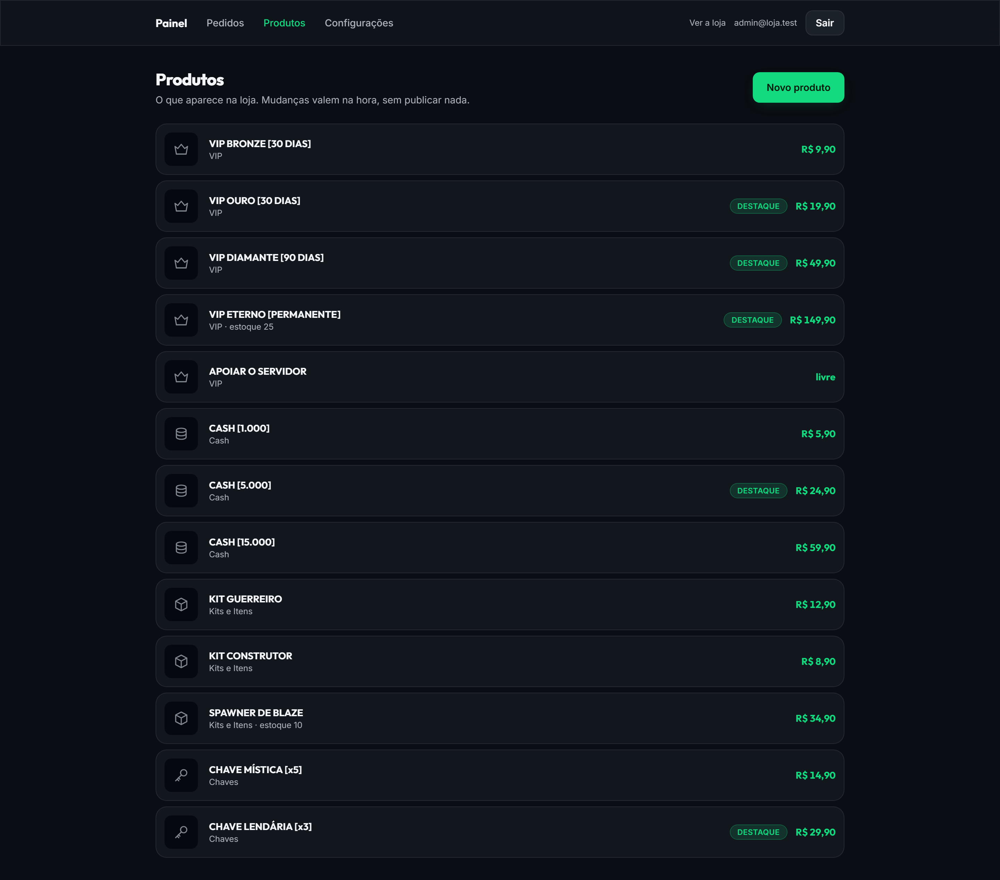

A lista de tudo o que existe na loja, ativo ou não, agrupada por categoria. As
etiquetas mostram o que está **inativo** e o que está **em destaque**.

## 13. Cadastro de produto

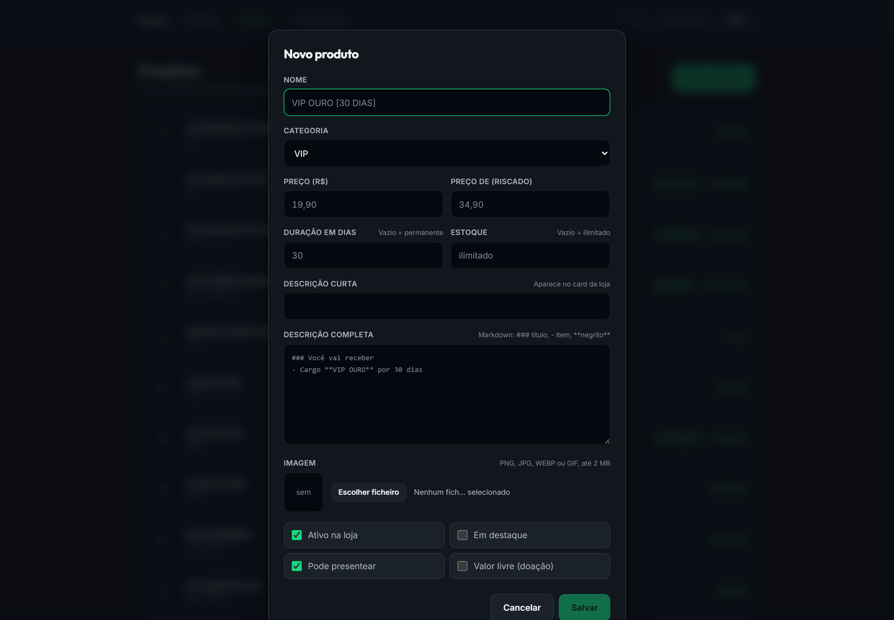

O formulário de criar ou editar. Campo por campo:

| Campo | Para que serve |
|---|---|
| **Nome** | Como aparece na loja. Costume do mercado brasileiro: maiúsculas com o detalhe entre colchetes — `VIP OURO [30 DIAS]` |
| **Categoria** | Onde ele aparece no catálogo |
| **Preço (R$)** | O valor cobrado |
| **Preço de (riscado)** | O valor "antigo", que aparece cortado ao lado. É o que cria a sensação de desconto |
| **Duração em dias** | Para VIP por tempo. Vazio = permanente |
| **Estoque** | Vazio = ilimitado. Com número, a loja marca "Esgotado" sozinha quando zerar |
| **Descrição curta** | A frase que aparece no card da loja |
| **Descrição completa** | O bloco "Você vai receber". Aceita `### título`, `- item` e `**negrito**` |
| **Imagem** | PNG, JPG, WEBP ou GIF, até 2 MB |
| **Ativo na loja** | Desmarcado, some da loja sem ser apagado |
| **Em destaque** | Aparece na página inicial |
| **Pode presentear** | Libera a opção de comprar para outro jogador |
| **Valor livre (doação)** | O comprador escolhe quanto quer pagar, respeitando um mínimo |

> Produto que **já foi vendido alguma vez não é apagado de verdade** — ele é
> apenas desativado. Isso protege o seu histórico: um pedido antigo continua
> mostrando o que foi comprado e por qual preço.

## 14. Configurações

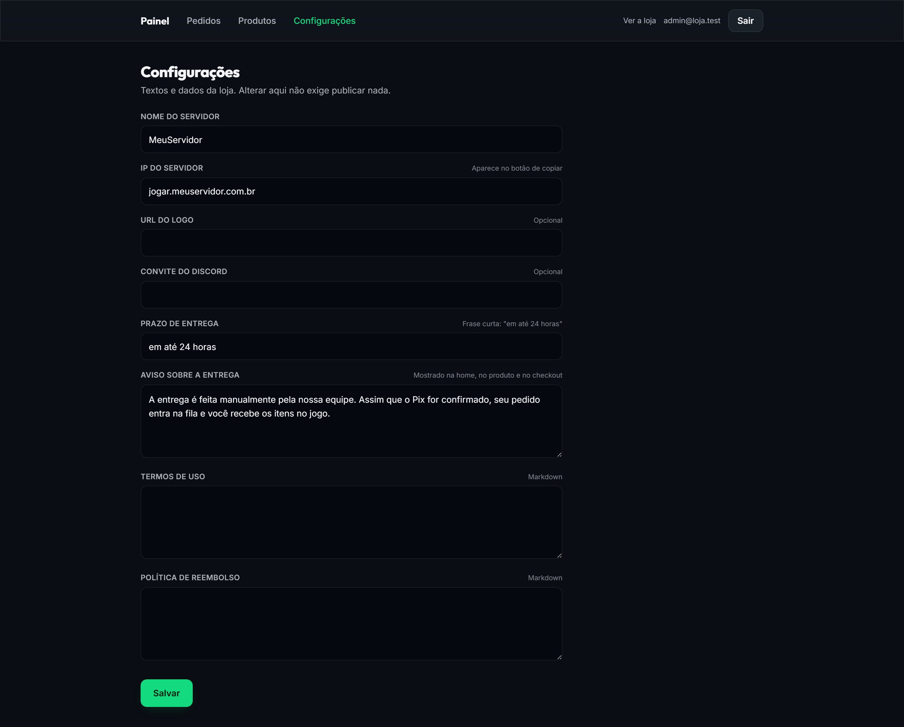

Os textos e dados da loja. Como diz o subtítulo da tela: **alterar aqui não exige
publicar nada** — salvou, já está no ar.

| Campo | Onde aparece |
|---|---|
| **Nome do servidor** | Topo, título da página inicial, rodapé |
| **IP do servidor** | No botão de copiar do topo e da página inicial |
| **URL do logo** | Substitui a letra do canto por uma imagem sua |
| **Convite do Discord** | Link para a sua comunidade |
| **Prazo de entrega** | Frase curta ("em até 24 horas") usada nas telas de compra |
| **Aviso sobre a entrega** | A faixa amarela da home e o aviso do checkout |
| **Termos de uso** | A página de termos |
| **Política de reembolso** | A página de reembolso |

---

# Parte 3 — No celular

A maior parte dos jogadores compra pelo celular, e a loja foi feita pensando
nisso primeiro.

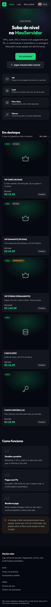

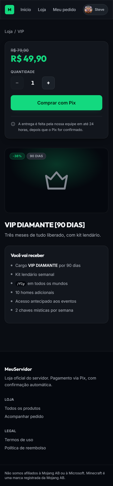

O layout se reorganiza em uma coluna, os cards viram lista e o botão de comprar
fica sempre acessível. O "copia e cola" do Pix tem o mesmo destaque do QR Code
justamente porque, no celular, é ele que a pessoa vai usar.

---

## Continue por aqui

- [Como colocar a loja no ar](02-implantacao-cloudflare.md) — passo a passo,
  incluindo a conta do Mercado Pago
- [Segurança](03-seguranca.md) — o que protege o seu dinheiro e o dos jogadores
- [Estrutura do código](04-estrutura-do-codigo.md) — para quem for mexer no sistema
- [Operação e manutenção](05-operacao-e-manutencao.md) — o dia a dia, custos e
  problemas comuns
